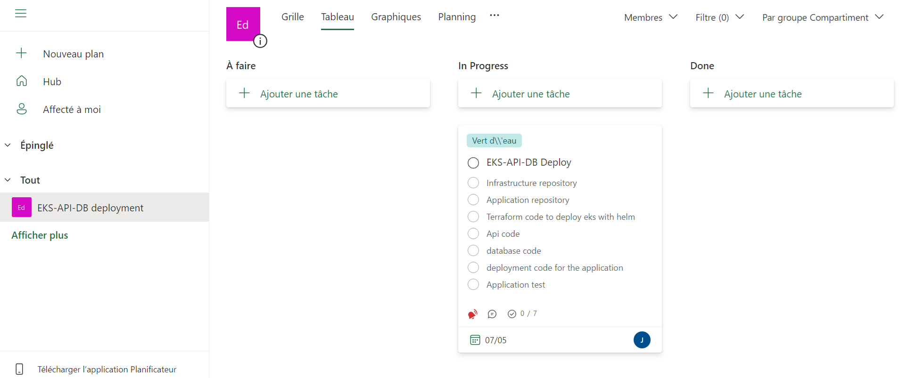
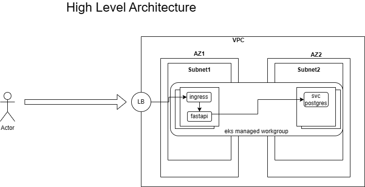

# Technical Interview Exercise
Deploy a sample API with potentially several replicas and its database using persistent storage.
Use gunicorn to bring the python application ready for production and then adding nginx for its communication to outside world as well as load balancing the service.
This repo also includes the dockerfiles to build the containers for each portion of the app, fastapidocker and compose with postgres db to test, then it also would include the kubernetes .yaml files to deploy the application to kubernetes cluster.

There are two folders, one with the application code, dockerfile, and k8s yaml, helm files. The other with the terraform code to deploy the k8s cluster. In each folder there is a readme.md which explains all the required components, prerequisites and the commands to execute the solution.

This is the user story created with different steps created as a list of items in office365 planner:



## About
- 📦 This app has been refactored for containerization and uses nonroot user for security, promoting consistent operating environments and seamless deployments using [Docker](https://www.docker.com/).
- 🚀 This app uses the [FastAPI](https://fastapi.tiangolo.com/) framework. FastAPI is a high-performance web framework for building APIs with Python 3.6+ that provides built-in support for asynchronous code. It is highly extensible and compatible with REST, OpenAPI, GraphQL, gRPC, and other protocols.
-  ✅ This app uses [Pydantic](https://docs.pydantic.dev/) data validation. Pydantic provides a declarative way to define data schemas and models that can be used across different protocols and API styles. The use of Pydantic models also allows FastAPI to automatically generate API documentation, perform data validation, and serialize/deserialize request and response data, making it easier to build and maintain high-performance APIs.
-  💾 This app leverages [SQLAlchemy](https://www.sqlalchemy.org/) for data persistence. A comprehensive ORM implementation is included to automate the interaction with the PostgreSQL database. The SQLAlchemy ORM provides a high-level, Pythonic interface to the database, while still allowing for complex, lower-level SQL constructs. This integration of SQLAlchemy with our Docker containerization process ensures the app is fully equipped to handle complex data structures and queries, making it a powerful, ready-to-run, fully containerized app.
-  🗃️ This app leverages [PostgreSQL](https://www.postgresql.org/) for data persistence. A comprehensive initialization script is included to automate the setup of the PostgreSQL database. The script creates a database user, database, and the database table. This integration of the script with our Docker containerization process means the app is fully prepared for container-based deployment, complete with its database setup, epitomizing a ready-to-run, fully containerized app.

## Technical Decisions
It was decide to implement an API in python because it is the language i have been using more lately, and also because there exist a great library FastAPI which gives you directly the swagger model of data, and allows you to interact directly with methods from a browser terminal, there is also some great libraries like pydantic that allows you to easily interact with different structure models of the database.
I decide to go with the postgres for database in order to interact easily because it is a relational database.
For the deployment of eks cluster i go with the use of curated model from aws and hashicorp, in order to have easily deployment of the infrastructure as well as have the capacity to add components in the future using these templates.
For terraform structure i use a kind of personal model, were i have static folders for the configuration of each environment, and i also have backend configuration for each environment, it also support the usage of personalized modules, but for the purpose of the exercise i just use the main.tf files and there instante the aws and vpc modules from hashicorp.

This is high level diagram of the architecture of the solution:



## Prerequisites
- [Install Docker](https://docs.docker.com/get-docker/)
- [Install Docker Compose](https://docs.docker.com/compose/install/)

## Installation
1. Clone the repository.
```
git clone https://github.com
```
2. Navigate into the pyapi directory and edit there the .env file which contains the credentials as you desire.
```
cd pyapi
vi .env
```


## Local Quickstart
set up the database and the application using docker compose.

1. In the project directory (pyapi), execute next command to execute the solution detached:
```
docker compose -f docker.compose.yaml up -d
```

At this point, the application should be running at [http://localhost:8000/](http://localhost:8000/). To stop the applicationa and remove created volume, you can run:
```
docker compose -f docker.compose.yaml down -v
```

2. To restart or rebuild the application, you can run:
```
docker compose -f docker.compose.yaml up --build
```

## Documentation
FastAPI autogenerates an OpenAPI specification, which allows you to test this application directly from an interactive console in your browser. It uses the [Pydantic](https://docs.pydantic.dev/) model to validate user input (as shown in the models section of the specification, below). Go to [http://0.0.0.0:8000/docs](http://0.0.0.0:8000/docs) to use the automatic interactive API documentation for this application (provided by [Swagger UI](https://github.com/swagger-api/swagger-ui)) to send requests. 


